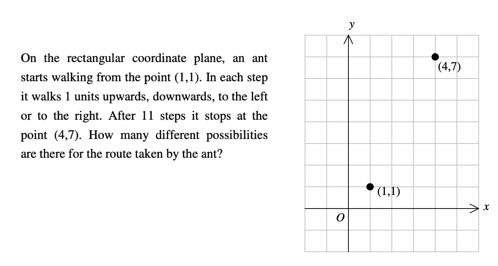

# Maff's Meefquiz
## Question 12

### Question

### Solution
#### This is a simple problem in Combinatronics.
Think of 11 slots, with 4 possible entries. So, we have a superset of 411 combinations.  
We can see that it takes **6 steps up** and **3 steps left** to reach ***(4,7)*** from ***(1,1)***, in any order.  So, we have to arrange 6 and 3 into 9 slots.  
Also, the other 2 (we need 11 steps precisely) steps will be all pairs of counter-steps (CS), namely:  
**CS:{(up,down),(down,up),(left,right),(right,left)}**.  
At the end, it reduces to this problem:  
In 11 slots, add 3 of A, 6 of B and 1(2, since CS is a pair of steps) out of CS.
#### Easy! Done :partying:

<strike>(Numerical solution will be posted only after the time's :up:!)</strike>  

Confirmed by /T/Kowshik22. 
https://itsn1x.github.io/8761_meefsol/sols/q12 
We can reduce it to a problem of re-arranging the letters in a word: 
  Rearrange "UUUUUULLLLR" into all possible words, and 
  Rearrange "UUUUUULLLUD" into all possible words. 
  We notice in first case, the possible arrangements are 11!/(6!4!1!0!) 
  and, in the second case, the possible arrangements are 11!/(7!3!0!1!) 
  (considering U:up, D:down, L:left and R:right). 
  Hence, the final answer is: 1320+2310 = 3630.

<h1> $: <a href="https://9xo.github.io" target="_blank"> https://9xo.github.io </a></h1>
