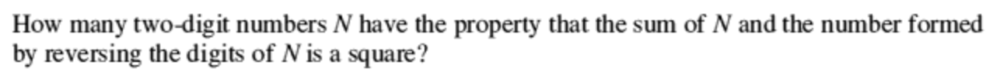

# Maff's Meefquiz
## Question 13
#### [PREV](q12.md) :: [NEXT](q14.md)
### Problem

### Solution
This is a simple problem in algebra.  
Think of a N as a two digit number `ij`.  
Essentially, `N=10i+j`.  
Revesed, M: `M=10j+i`.  
Question tells us, sum of N and M is a Square.  
So, `10i+j+10j+i` is a square.  
Or, `11(i+j) is.`  
Now, i and j are digits 0 to 9, so i+j is under or equal to 18(0+0,9+9).  
11 is **prime**, so the square is surely 121.  
Thats why `i+j` is 11.  
#### Possible solutions:
 - 2,9
 - 3,8
 - 4,5
 - 5,4
 - 6,5
 - 7,4
 - 8,3
 - 9,2  
**Answer:** 8 solutions to ***N***.  
## (Numerical solution will be posted only after the time's :up:!) 
#### Easy! Done!!!

<h1> $: <a href="https://9xo.github.io" target="_blank"> https://9xo.github.io </a></h1>
