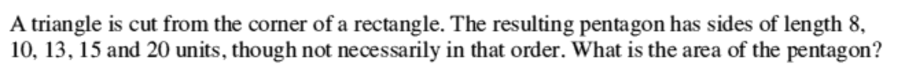

# Maff's Meefquiz
## Question 14
#### [PREV](q13.md) :: [NEXT](q15.md)
### Problem

### Solution
#### This is a simple problem in geometry.  
----
Think like this:  
The diagram should be somewhat similar to this: 
<svg preserveAspectRatio="none" viewBox="0 0 200 300" height="200px" width="300px">
<polyline stroke="red" stroke-width="1" points="0,0 0,300 200,300 200,0 0,0" fill="rgba(100,0,100,0.2)">
</polyline><polyline stroke="red" stroke-width="1" fill="rgba(400,0,400,0.2)" points="0,0 90,0 0,150"></polyline>
</svg></img>
 
We can see that:  
 - [x] One of the sides of Pentagon is the **Hypotnuse** to the triangle.
 - [x] Two of the other sides is the Recatngle's length (and breadth) minus the triangle's corresponding sides.  

We are given the lengths as **8,10,13,15,20**.
Therefore, one of these is a hypotnuse **and** an integer.
We know that only 13 among these appears in a **Pythagorean Triplet**. That's why 13 is the hypotnuse.  
- Now, 20 cannot be the cut-out length, beacause the opposite side on the recctangle cant be more than that (20+triangle's side)!  
- Similary, if we assume 15 to be a cut-ot length, its opposite on the rectangle will be more than that (15+triangle's other side)!  
Thus, the rectangle is 15 units wide and 20 long.  
Now just find the area of Triangle, deduct it from the Rectangle's area -- The result is the Pentagon's area!

----
## (Numerical solution will be posted only after the time's :up:!) 
#### Easy! Done!!!

<h1> $: <a href="https://9xo.github.io" target="_blank"> https://9xo.github.io </a></h1>
