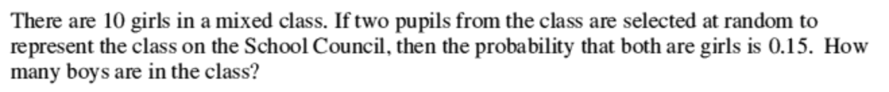

# Maff's Meefquiz
## Question 15
#### [PREV](q15.md) :: [NEXT](q16.md)
### Problem

### Solution
#### This is a simple problem in probability!  
We have been told three things:
 - There are 15 girls in the class.
 - Only two students can be selected.
 - Selection of 2 girls has 15% chance.  

Let the class strength be `T`.  
Then, we can select 2 kids in TC2 ways.  
Having both as girls will have the chances as 10C2.
The ratio of these is the 15% probability.  
Therefore,  
10C2 / TC2 = 0.15.  
After cutting, crossing, swapping and rearranging, we will have a quadriatic equation: ***T2-T=600***.  
This gives `T` as 25 or -24.  
Now we know from experience that kids aren't so negative.  
That's why there are 25 students and 15 are boys.  
#### Verification
We can check this result:  
If we select "both aren't girls", we should have 85%.  
Essentially, ( 15C2 + ( 10C1 x 15C1 ) ) / TC2 = 0.85.  
Math checks out!

----
----

## <strike> (Numerical solution will be posted only after the time's :up:!) </strike>
#### Easy! Done!!!

<h1> $: <a href="https://9xo.github.io" target="_blank"> https://9xo.github.io </a></h1>
